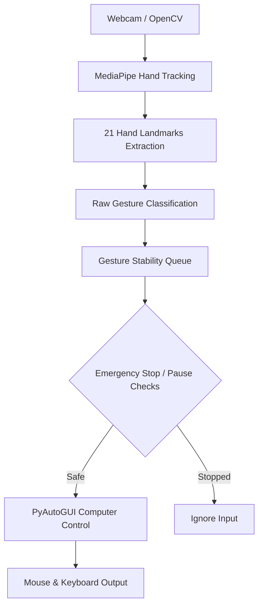

<div align="center">
  <h1>🖱️ AI Vision Computer Controller 🤖</h1>
  <p>Control your computer's mouse and keyboard using real-time hand gestures and your webcam!</p>

  
  
  
  
</div>

<br/>

A powerful, real-time hand gesture recognition system built with **OpenCV** and **MediaPipe**. This project prioritizes **low latency**, a **professional UI**, and **robust safety mechanisms**.

---

## ✨ Features

- 🎯 **Cursor Control**: Move your mouse smoothly by pointing your index finger.
- 🖱️ **Left Click**: Pinch your index finger and thumb together.
- 🖲️ **Right Click**: Pinch your middle finger and thumb together.
- 📜 **Two-Finger Scroll**: Raise your index and middle fingers together and move them up/down to scroll naturally.
- ⌨️ **Thumbs Up (Enter)**: Make a thumbs-up gesture to press the Enter key.
- ⏸️ **Open Palm (Pause)**: Hold up an open palm to gracefully pause all mouse and keyboard actions.
- 🛑 **Fist (Escape)**: Make a closed fist to instantly press the Escape key.
- 🛡️ **Gesture Stability Engine**: All gestures run through a rolling history queue (166ms) to guarantee no accidental clicks from tracking glitches.
- 🚨 **Emergency Stop (Safety First)**: A hardware-level override. Press the `ESC` key to instantly cut all computer control without killing the camera feed.
- 🖥️ **Professional UI Dashboard**: A sleek side-panel displaying live tracking status, FPS, current stable gesture, and active controls.

---

## ✋ Gesture Guide

| Gesture Shape | Action Triggered |
| :---: | :--- |
| ☝️ **1 Finger (Index)** | **Move Cursor** smoothly across the screen. |
| 🤏 **Pinch (Index + Thumb)** | **Left Click** the mouse. |
| ✌️ **2 Fingers (Index + Middle)** | **Scroll Up / Down** (Move hand vertically). |
| 🤏 **Mid Pinch (Middle + Thumb)** | **Right Click** the mouse. |
| 👍 **Thumbs Up** | Press **Enter** key. |
| ✋ **Open Palm** | **Pause** Control. |
| ✊ **Closed Fist** | Press **Escape** key. |

---

## 🏗️ Architecture Pipeline



---

## ⚙️ Installation & Setup

1. **Clone this repository** to your local machine.
2. **Install Python** (3.8 or higher is recommended).
3. **Install the required dependencies** using `pip`:
   ```bash
   pip install opencv-python mediapipe pyautogui
   ```

---

## 🎮 How to Run

1. Open a terminal or command prompt.
2. Navigate to the project directory.
3. Run the main application:
   ```bash
   python main.py
   ```
4. Step back so your hand is clearly visible in the camera frame and start controlling!

### ⌨️ Keyboard Shortcuts 
*(Note: The AI Vision Controller window must be focused)*
- **`ESC`**: Activate Emergency Stop (disables all gestures immediately).
- **`R`**: Resume control from Emergency Stop.
- **`S`**: Stop / Start the camera feed.
- **`Q`**: Quit the application entirely.

---

## 🛡️ Safety Information

This application directly controls your operating system's mouse and keyboard. 
- **Emergency Stop**: If the cursor ever moves erratically or you need to type on your physical keyboard without interference, immediately press the physical **`ESC`** key.
- **Camera Stop**: Pressing **`S`** stops the camera frame processing, which also inherently disables all tracking.
- **Failsafe**: PyAutoGUI's built-in failsafe is intentionally disabled in the code (`pyautogui.FAILSAFE = False`) to allow the cursor to smoothly reach the edges of your screen. Our robust Emergency Stop and Pause gestures replace it.

---

## 📁 Project Structure

- `main.py`: The entry point. Handles the camera loop, UI rendering, and orchestrates the tracking pipeline.
- `config.py`: Centralized configuration. Contains all tunable parameters (cooldowns, colors, thresholds) so they can be tweaked without altering logic.
- `hand_tracker.py`: Encapsulates MediaPipe logic, landmark extraction, and boolean heuristics for complex gestures (Thumbs Up, Fist, Open Palm).
- `cursor_controller.py`: Manages the stateful logic of moving the cursor, managing cooldowns, evaluating gesture stability, and firing PyAutoGUI actions.

---

## ⚠️ Limitations & Known Issues

- **Background Interference**: Highly complex backgrounds or other faces/hands in the frame may occasionally confuse the MediaPipe model.
- **Lighting**: Extremely low light or direct glare into the webcam will reduce tracking confidence and may cause the cursor to pause or stutter.
- **Multi-Monitor**: The current coordinate mapping automatically scales to the primary display. Moving the cursor to secondary monitors may require additional mapping logic.

---

<div align="center">
  <i>Built with ❤️ using OpenCV & MediaPipe</i>
</div>
